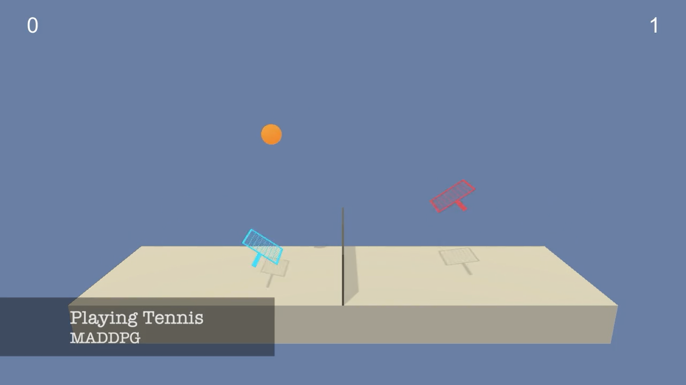

# Project 3 - Udacity Deep Reinforcement Learning Nanodegree

## Playing Tennis with MADDPG

<center></center>

## 1. Problem Formulation

In this environment, two agents control rackets to bounce a ball over a net. If an agent hits the ball over the net, it receives a reward of ``+0.1``. If an agent lets a ball hit the ground or hits the ball out of bounds, it receives a reward of ``-0.01``. Thus, the goal of each agent is to keep the ball in play.

The observation space consists of ``8`` variables corresponding to the ``position`` and ``velocity`` of the ``ball`` and ``racket``. Each agent receives its own, local observation. Two continuous actions are available, corresponding to movement toward (or away from) the net, and jumping.

### State Space

The observation space consists of ``24`` variables corresponding to position, rotation, velocity, and angular velocities of the arm. A sample observation for one of the  agents looks like this :

```python
  0.          0.          0.          0.          0.          0.
  0.          0.          0.          0.          0.          0.
  0.          0.          0.          0.         -6.65278625 -1.5
 -0.          0.          6.83172083  6.         -0.          0.        
 ```

### Action Space

Each action is a vector with ``2`` numbers, corresponding to velocity applicable to the racket. Every entry in the action vector should be a number between ``-1`` and ``1``.

### Solve Criteria

The task is episodic, and the score for one episode is the maximum score between two agents. In order to solve the environment, agents must get an average score of ``+0.5`` (over ``100`` consecutive episodes, after taking the maximum over both agents).

## Instructions and Structure

### Notebooks

1. Use ``MADDPG-Train.ipynb`` notebook for Training.
1. Use ``MADDPG-Test.ipynb`` notebook for Training.
1. For Report check out ``Report.ipynb`` notebook.

### Scripts file

1. ``agents.py`` contains a code for a MADDPG and DDPG Agent.
1. ``brains.py`` contains the definition of Neural Networks (Brains) used inside an Agent.

### Folders

1. ``TrainedAgents`` folder contains saved weights for trained agents.
1. ``Benchmark`` folder contains saved weights and scores for benchmarking.
1. ``Images`` folder contains images used in the notebooks.
1. ``Movies`` folder contains recorded movies from each Agent.

## Seting up Environment

It is highly recommended to create a separate python environment for running codes in this repository. The instructions are the same as in the Udacity's Deep Reinforcement Learning Nanodegree Repository. Here are the instructions:

1. Create (and activate) a new environment with Python 3.6.

	- __Linux__ or __Mac__: 
	```bash
	conda create --name drlnd python=3.6
	source activate drlnd
	```
	- __Windows__: 
	```bash
	conda create --name drlnd python=3.6 
	activate drlnd
	```
	
2. Follow the instructions in [this repository](https://github.com/openai/gym) to perform a minimal install of OpenAI gym.

- Here are quick commands to install a minimal gym, If you ran into an issue, head to the original repository for latest installation instruction:


	```bash
	pip install box2d-py 
	pip install gym
	```  

	
3. Clone the repository (if you haven't already!), and navigate to the `python/` folder.  Then, install several dependencies.
```bash
git clone https://github.com/taesiri/udacity_drlnd_project3
cd udacity_drlnd_project3/
pip install .
```

4. Create an [IPython kernel](http://ipython.readthedocs.io/en/stable/install/kernel_install.html) for the `drlnd` environment.  
```bash
python -m ipykernel install --user --name drlnd --display-name "drlnd"
```

5. Open the notebook you like to explore.

## Video

See it in action here:

[](https://youtu.be/2zeY2X5Njug "Tennis!")
